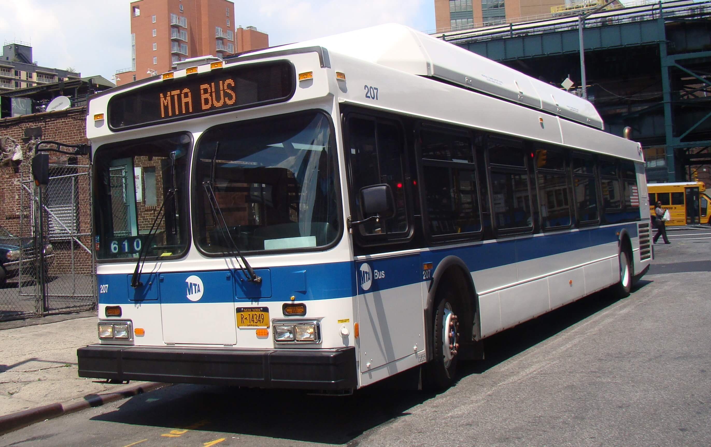
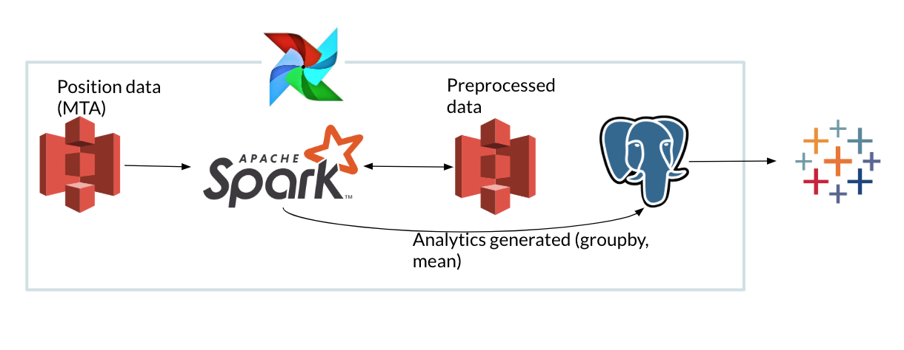

# StopToStop
**StopToStop** is my Insight Data Engineering project. It is an automated batch processing pipeline that takes one day's worth of bus position data and calculates, and then aggregates, trip durations at stop-to-stop granularity for time windows in order to identify irregularities in a given route.

#### Purpose

I believe we are all, in our hearts, back-seat drivers, especially when we have somewhere to be. One of the most painful experiences as a bus passenger is being stuck in stop and go traffic and wondering if another route may have been faster. It's even worse when you're stuck because of a high school football game or some other event that happens with regularity. 

The fact of the matter is that buses don't have memories, and it's far from a sure thing that the same drivers drive the same routes at the same times week after week. Furthermore, drivers can't be expected to anticipate and maneuver around traffic even if that decision were theirs to make. So, how can we better inform metro authorities about potential slowdowns before they occur, and make public transit more reliable in the process?

#### Solution

I use bus position data to generate trip duration metrics and aggregate them over weeks, days, and hours.

[GTFS](https://gtfs.org/) (Google Transit Feed Specification) data is fairly well standardized around the world, and GTFS-realtime data provides metro authorities and developers alike with vehicle position data. But how do we get from vehicle positions to accurate trip duration estimates, particularly when GPS data is notoriously faulty and data points from GTFS-realtime arrive only every two or so minutes?  

This automated pipeline uses vehicle position data gathered by MTA of New York City and generates patterns and trends of bus performance at a stop-to-stop granularity, so that the smallest possible segment of a route is monitored. It makes use of Spark, though for smaller metro authorities, or those with less granular GTFS-realtime position update data, pandas may well be the more sensical option.

#### Architecture

MTA of NYC stores vehicle position data, generated every ~2-5 minutes, in a publicly accessible bucket on **AWS S3**. Via a daily **Airflow** job, StopToStop downloads the data from the most recent day and decompresses the data before storing it in **HDFS** so that it can be read from worker nodes. (Though I have seen an XZ-decompressing codec used for Spark in Scala, I could not get it to be operational in pyspark.) The position data, joined with GTFS-static schedule data, is used to calculate approximate times spent between one stop and the next. To avoid costly Postgres queries that are forced to take groupby-aggregations of this data, I then store these preprocessed results in an S3 bucket. The preprocessed data is then aggregated in another Spark job (process.py) to render tables for week, day, and hour averages for each stop-to-stop interval. The results are fed into a **AWS RDS Postgres** instance, wherefrom they are retrieved and visualized in **Tableau**.

#### Interesting GTFS data quirks

- Though `trip_id` in GTFS-realtime vehicle position feed is intended to be unique, there are plenty of examples of this not being the case. Luckily, there are no concurrent routes using the same `trip_id`. Taking the difference of `stop_sequence`'s with multiple `trip_id`'s in one day makes `time_per_stop` negative (e.g., a `stop_sequence` of 1 *follows* a `stop_sequence` of 28). These records must be removed, but not until after time difference is calculated for succeeding stops in the second trip. That is, the time to get to `stop_sequence` 1 of the *second* trip is invalid, but time to get from 1 to 2 in the second trip is valid.
- A bus may well be headed to a specific stop for multiple timestamps. We must take the **minimum** timestamp from these records, and filter out the rest.
- A stop in the trip's stop sequence may not be represented in the vehicle position data (i.e., the bus has passed multiple stops in the time between timestamps). The next immediate time/stop, therefore, must be **backfilled** to accommodate these "hidden" stops.